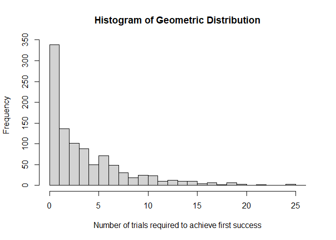

Formative Assessment 6
================

## Geometric Distribution

Provide an R code for the geometric distribution. The geometric
distribution is a probability distribution that models the number of
trials required to achieve the first success in a sequence of Bernoulli
trials, where each trial has a constant probability of success.

\*\* Example \*\*

``` r
# Set the probability of success
p <- 0.2

# Generate 1000 random variables from the geometric distribution
x <- rgeom(1000, p)

# Calculate basic statistics
mean_x <- mean(x)
var_x <- var(x)
sd_x <- sd(x)

# Print the results
cat("Number of trials required to achieve first success:\n")
```

    ## Number of trials required to achieve first success:

``` r
cat("Mean:", format(mean_x, digits = 2), "\n")
```

    ## Mean: 4.1

``` r
cat("Variance:", format(var_x, digits = 2), "\n")
```

    ## Variance: 19

``` r
cat("Standard deviation:", format(sd_x, digits = 2), "\n")
```

    ## Standard deviation: 4.4

``` r
# Plot histogram
hist(x, breaks = 30, main = "Histogram of Geometric Distribution", xlab = "Number of trials required to achieve first success", ylab = "Frequency")
```

<!-- -->

## Hypergeometric Distribution

Consider a plant manufacturing IC chips of which 10% are expected to be
defective. The chips are packed in boxes for export. Before
transportation, a sample is drawn from each box. Estimate the
probability that the sample contains more than 10% defectives, when:

### A sample of 10 is selected from a box of 40;

``` r
# Function to calculate probability of more than 10% defectives in a sample from a hypergeometric distribution
prob_more_than_10_percent_defectives <- function(sample_size, total_items, defective_items, more_than_percentage) {
  if (sample_size > total_items) {
    return("Error: Sample size cannot be greater than total items.")
  }
  
  # Probability of selecting more than 10% defectives
  prob <- 1 - phyper(floor(defective_items * more_than_percentage), defective_items, total_items - defective_items, sample_size)
  
  return(prob)
}

# For sample of 10 from a box of 40
sample_size_1 <- 10
total_items_1 <- 40
defective_items_1 <- 0.1 * total_items_1

# Estimate probability for the given scenario
prob_1 <- prob_more_than_10_percent_defectives(sample_size_1, total_items_1, defective_items_1, 0.1)

cat("Probability of more than 10% defectives in a sample of 10 from a box of 40:", prob_1, "\n")
```

    ## Probability of more than 10% defectives in a sample of 10 from a box of 40: 0.7001313

### A sample of 10 is selected from a box of 5000;

``` r
# For sample of 10 from a box of 5000
sample_size_2 <- 10
total_items_2 <- 5000
defective_items_2 <- 0.1 * total_items_2

# Estimate probability for the given scenario
prob_2 <- prob_more_than_10_percent_defectives(sample_size_2, total_items_2, defective_items_2, 0.1)

cat("Probability of more than 10% defectives in a sample of 10 from a box of 5000:", prob_2, "\n")
```

    ## Probability of more than 10% defectives in a sample of 10 from a box of 5000: 0
