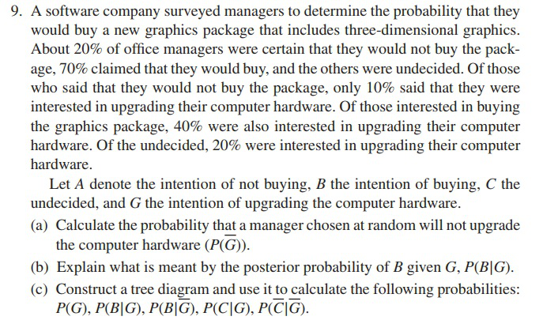

 # Formative Assessment 5

### MONFERO, John Benedict A.
### PATAYON, Spike Lee-Roy V.

#### Answer Exercises 7.1 items 6, 9, and 13.


**Assign the following given into three distinct vectors labeled as:**

``` r
server <- c(1, 2, 3)
percent_messages <- c(40, 25, 35)
percent_errors <- c(1, 2, 1.5)
```

**Create the Dataframe containing the three vectors:**
```r
data <- data.frame(server, percent_messages, percent_errors)
data
```
**Output DataFrame**
```output
##        server          percent_messages    percent_errors
## 1      1               40                  1.0
## 2      2               25                  2.0
## 3      3               35                  1.5

```

### (a) what is the probability of receiving an email containing an error?

Since in the given dataframe above, vectors `percent_messages` and `percent_errors` were holding values in terms of percentages, each shall be divided into 100, to represent the probability in terms of decimal;
```r
percent_messages <- percent_messages/100
percent_errors <- percent_errors/100

# Through Law of Total Probability
p_error <- sum(percent_messages * percent_errors)

# Output for getting the probability of receiving an email containing an error
cat("a. Probability of receiving an email containing an error: ", p_error, "or ", (p_error*100))
```

```output
## a. Probability of receiving an email containing an error: 0.01425 or 1.425%
```

### (b) What is the probability that a message will arrive without error?
```r
# Through Law of Complementary Probability
p_no_error <- 1 - p_error

# Output for getting the probability of receiving an email without containing an error
cat("b. probability of receiving an email without containing an error: ", p_no_error, "or ", (p_no_error*100), "\n")
```

```output
## b. probability of receiving an email without containing an error: 0.98575 or 98.575%
```

### (c) If a message arrives without error, what is the probability that it was sent through server 1?
Mathematically, find the probability:

$$ P(S_1 | \overline{E}) $$

Given only the following so far:

$$ P(\overline{E} | S_1) \text{ , } P(S_1) \text{ and } P(\overline{E}) $$

Through Bayes Theorem:

$$ P(S_1 | \bar{E}) = \frac{P( \bar{E} | S_1)*P(S_1)}{P(\bar{E})} $$

```r
# Through Bayes' theorem
p_no_error_given_server1 <- 1 - 0.01
p_server1 <- 0.4
p_server1_given_no_error <- p_no_error_given_server1 * p_server1 / p_no_error

cat("c. Probability that a message was sent through server 1 given that it arrived without error:", p_server1_given_no_error, "or ", (p_server1_given_no_error*100), "\n")
```
```output
## c. Probability that a message was sent through server 1 given that it arrived without error: 0.401725 or  40.1725%
```


