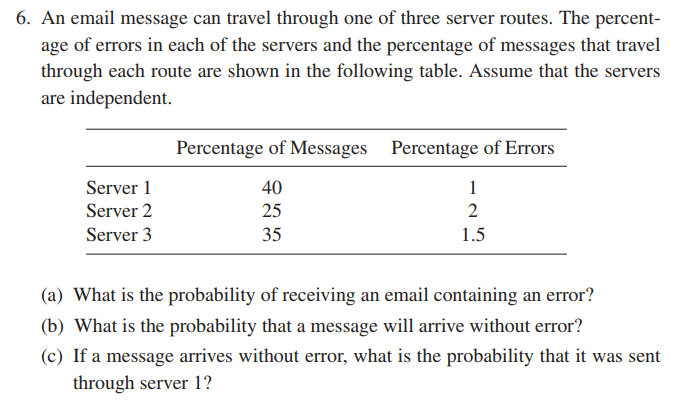
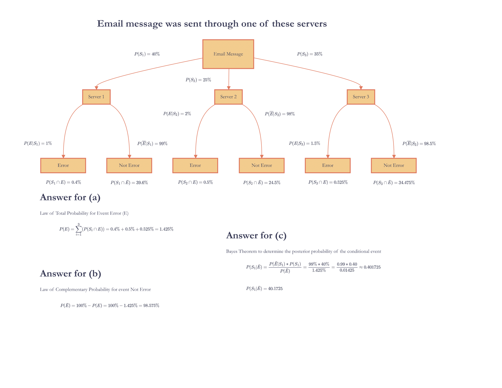
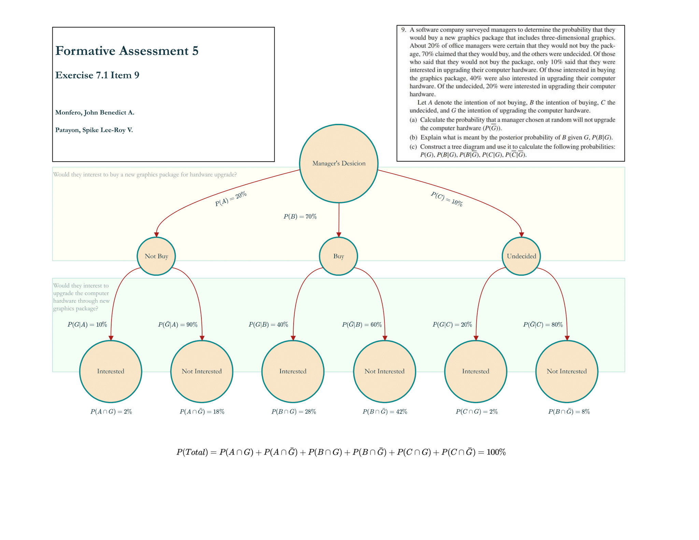

 # Formative Assessment 5

### MONFERO, John Benedict A.
### PATAYON, Spike Lee-Roy V.

#### Answer Exercises 7.1 items 6, 9, and 13.



**Assign the following given into three distinct vectors labeled as:**

``` r
server <- c(1, 2, 3)
percent_messages <- c(40, 25, 35)
percent_errors <- c(1, 2, 1.5)
```

**Create the Dataframe containing the three vectors:**
```r
data <- data.frame(server, percent_messages, percent_errors)
data
```
**Output DataFrame**
```output
##        server          percent_messages    percent_errors
## 1      1               40                  1.0
## 2      2               25                  2.0
## 3      3               35                  1.5

```

### (a) what is the probability of receiving an email containing an error?

Since in the given dataframe above, vectors `percent_messages` and `percent_errors` were holding values in terms of percentages, each shall be divided into 100, to represent the probability in terms of decimal;
```r
percent_messages <- percent_messages/100
percent_errors <- percent_errors/100

# Through Law of Total Probability
p_error <- sum(percent_messages * percent_errors)

# Output for getting the probability of receiving an email containing an error
cat("a. Probability of receiving an email containing an error: ", p_error, "or ", (p_error*100), "\%\n")
```

```output
## a. Probability of receiving an email containing an error: 0.01425 or 1.425%
```

### (b) What is the probability that a message will arrive without error?
```r
# Through Law of Complementary Probability
p_no_error <- 1 - p_error

# Output for getting the probability of receiving an email without containing an error
cat("b. probability of receiving an email without containing an error: ", p_no_error, "or ", (p_no_error*100), "\%\n")
```

```output
## b. probability of receiving an email without containing an error: 0.98575 or 98.575%
```

### (c) If a message arrives without error, what is the probability that it was sent through server 1?
Mathematically, find the probability:

$$ P(S_1 | \overline{E}) $$

Given only the following so far:

$$ P(\overline{E} | S_1) \text{ , } P(S_1) \text{ and } P(\overline{E}) $$

Through Bayes Theorem:

$$ P(S_1 | \bar{E}) = \frac{P( \bar{E} | S_1)*P(S_1)}{P(\bar{E})} $$

```r
# Through Bayes' theorem
p_no_error_given_server1 <- 1 - 0.01
p_server1 <- 0.4
p_server1_given_no_error <- p_no_error_given_server1 * p_server1 / p_no_error

cat("c. Probability that a message was sent through server 1 given that it arrived without error:", p_server1_given_no_error, "or ", (p_server1_given_no_error*100), "\%\n")
```
```output
## c. Probability that a message was sent through server 1 given that it arrived without error: 0.401725 or  40.1725%
```


#### Answer Exercises 7.1 items 6, 9, and 13.



**Assign the neccesary values** 
starting from the given `P(A), P(B), P(C)` and their intersections with event G in order to achieve `P(G)`

```r
# Event A: Managers will not buy
# Event B: Managers will buy
# Event C: Managers are undecided
prob_A <- 0.20
prob_B <- 0.70
prob_C <- 0.10

# Conditional Events: Who are interested on each events A, B, or C
prob_G_given_A <- 0.10
prob_G_given_B <- 0.40
prob_G_given_C <- 0.20

# Intersection of Events: If P(A) and P(G | A) are given, then we can determine P(A ∩ G), likewise for P(B ∩ G) and P(C ∩ G)
prob_A_and_G <- prob_G_given_A * prob_A
prob_B_and_G <- prob_G_given_B * prob_B
prob_C_and_G <- prob_G_given_C * prob_C

prob_G <- prob_A_and_G + prob_B_and_G + prob_C_and_G
```

### (a) Calculate the probability that a manager chosen at random will not upgrade the computer hardware
Through law of total probability, determine the probability of manager chosen will not upgrade the computer hardware as:

$$ P(\bar{G}) = P(A \cap \bar{G}) + P(B \cap \bar{G}) + P(C \cap \bar{G}) $$

or through law of complementary probability:

$$ P(\bar{G}) = 1 - P(G) = 1 - (P(A \cap G) + P(B \cap G) + P(C \cap G)) $$

Since `prob_A_and_G`, `prob_B_and_G`, and `prob_C_and_G` are given, it is easier to proceed through the law of complementary probability for the probability of not G `prob_notG` where:
```r
prob_notG <- 1 - prob_G

cat("a. The probability that a manager chosen at random will not upgrade the computer hardware:", prob_notG, "or ", (prob_notG*100), "\n")
```
```output
## a. The probability that a manager chosen at random will not upgrade the computer hardware: 0.68 or 68%
```

### (b) Explain what is meant by the posterior probability of B given G, P(B|G)
To begin we know that P(A) can be declared as:

$$ P(A) = \frac{\text{Event A}}{\text{Sample Space}}$$

Also, the fundamental concepts in Conditional Probability states that:

$$ P(G | B) \neq P(B | G) \hspace{10px} \text{ since } P(B) \neq P(G) $$

Since each deploying own meaning, thus. they meant other meaning;
`P(G | B)` means that we want to know the probability of **managers who are interested to upgrade** (event G), all of them must be already part of the **managers who are also interested to buy** (event B).

Mathematically, `P(G | B)` can be equated as:

$$ P(G|B) = \frac{P(B \cap G)}{P(B)} = \frac{\frac{B \cap G}{\text{All Managers}}}{\frac{B}{\text{All Managers}}} = \frac{B \cap G}{B}$$ 

The last expression states that the new reference of which is our sample space must be all come from the event B, meaning the information we want to determine the probability G must be all came from the event B.

Conversely, `P(B | G)` actually conveys different information, the given want us to determine the probability of having **managers who are interested to buy** (event B) given that all of them must be **managers who are interested to upgrade** (event G) first.

Nonetheless, through Bayes Theorem; given `P(G | B)`, `P(B)`, and `P(G)` we can determine the probability for `P(B | G)` as:

$$ P(B | G) = \frac{P(G | B) * P(B)}{P(G)} $$

Where `P(B | G)` is the posterior probability where we want to know the probability of getting **managers who are interested to buy** given the information or evidence of **managers who are interested to upgrade** where: 
1. `P(G | B)` are the likelihood of having information from the given event G, the the hypothesis event B was happened;
2. `P(B)` is the concerned information or the priori probability
3. `P(G)` is the priori probability where the evidence is already true by itself

$$ P(B | G) = \frac{P(G | B) * P(B)}{P(G)} = \frac{( \frac{B \cap G}{B} )* (\frac{B}{\text{All Managers}})}{\frac{G}{\text{All Managers}}} = \frac{B \cap G}{G} = \frac{G \cap B}{G} $$

```r
# Since the following priori events were given, determine the posterior probability of B given G;
prob_B_given_G <- (prob_G_given_B * prob_B)/(prob_G)

cat("b. the posterior probability of B given G:", prob_B_given_G,"\n")
```
```output
## b. the posterior probability of B given G: 0.875
```


