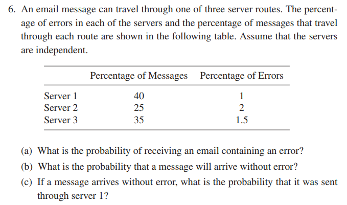

# Formative Assessment 5

### MONFERO, John Benedict A.
### PATAYON, Spike Lee-Roy V.

#### Answer Exercises 7.1 items 6, 9, and 13.


Assign the following values on three distinct vectors labeled as:

```{r}
server <- c(1, 2, 3)
percent_messages <- c(40, 25, 35)
percent_errors <- c(1, 2, 1.5)
```

Create the Dataframe containing the three vectors:
```{r}
data <- data.frame(server, percent_messages, percent_errors)
data
```

```{output}
##        server          percent_messages    percent_errors
## 1      1               40                  1.0
## 2      2               25                  2.0
## 3      3               35                  1.5
```

### What is the overall percentage of relevant images?
